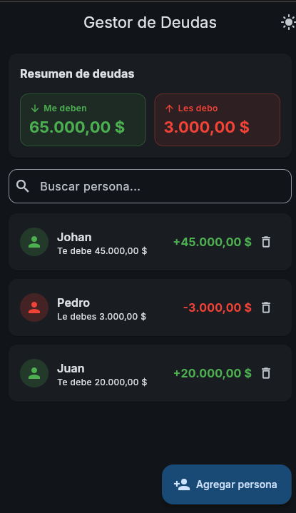
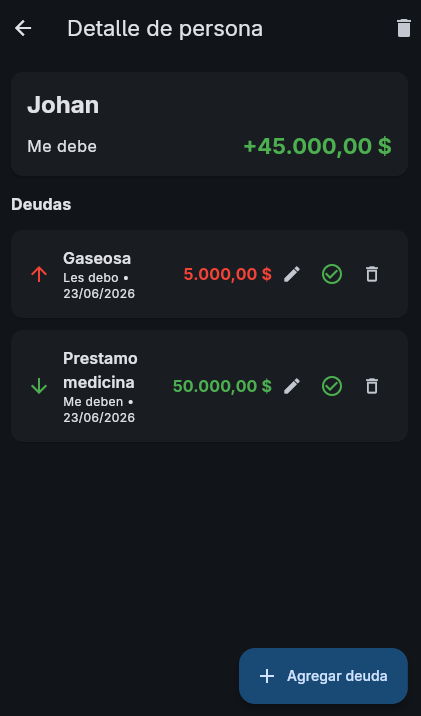
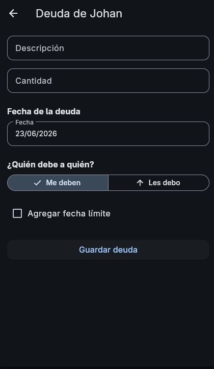

# Debt Tracker - Gestor de Deudas

Aplicación móvil desarrollada con **Flutter** para gestionar deudas personales de forma sencilla. Toda la información se guarda de manera local en el dispositivo usando **Hive**, por lo que no requiere registro, cuenta ni conexión a internet.

## Capturas de pantalla

> Para mantener el repositorio ligero, las capturas de pantalla se agregan en la carpeta `screenshots/` y se referencian desde aquí.

| Pantalla principal | Detalle de persona | Agregar/editar deuda |
|---|---|---|
|  |  |  |

*Reemplaza las imágenes anteriores por tus propias capturas de la app en funcionamiento.*

## Funciones principales

- **Personas:** agregar, eliminar y buscar deudores.
- **Deudas:** registrar deudas con descripción, fecha, cantidad y dirección (me deben / les debo).
- **Edición:** modificar cualquier deuda, incluyendo su fecha, cantidad, descripción y dirección.
- **Cancelación cruzada:** si con una persona existen deudas en ambas direcciones, el saldo se calcula de forma neta (ej. me deben 5000 y les debo 122 → saldo: me deben 4878).
- **Fecha límite opcional:** añade una fecha de vencimiento a cada deuda.
- **Historial de pagos:** marca deudas como pagadas en lugar de eliminarlas.
- **Resumen global:** en la parte superior se muestra cuánto te deben y cuánto debes, con saldo neto por persona.
- **Ordenamiento inteligente:** las personas se ordenan por la deuda más reciente; las deudas saldadas van al final.
- **Tema claro/oscuro:** el tema seleccionado se guarda localmente.

## Arquitectura

```
lib/
├── main.dart                    # Punto de entrada y proveedores globales
├── app.dart                     # Configuración de MaterialApp y tema
├── models/                      # Modelos Hive (Person, Debt, DebtType)
├── services/                    # HiveService y DebtRepository
├── blocs/                       # Cubits para gestión de estado y tema
├── screens/                     # Pantallas de la aplicación
└── widgets/                     # Widgets reutilizables
```

## Cómo ejecutar

1. Clona el repositorio:

   ```bash
   git clone https://github.com/tu-usuario/debt-tracker.git
   cd debt-tracker
   ```

2. Instala las dependencias:

   ```bash
   flutter pub get
   ```

3. Ejecuta la app en un dispositivo o emulador:

   ```bash
   flutter run
   ```

## Dependencias principales

- [`flutter_bloc`](https://pub.dev/packages/flutter_bloc): gestión de estado con BLoC/Cubit.
- [`hive`](https://pub.dev/packages/hive) y [`hive_flutter`](https://pub.dev/packages/hive_flutter): base de datos local ligera.
- [`intl`](https://pub.dev/packages/intl): formato de moneda y fechas.
- [`uuid`](https://pub.dev/packages/uuid): generación de identificadores únicos.
- [`path_provider`](https://pub.dev/packages/path_provider): ubicación de almacenamiento local.

## Notas

- La app usa **Material 3**.
- Todos los datos se almacenan localmente en el dispositivo.
- No se requiere conexión a internet ni registro de usuario.
- El tema claro/oscuro se persiste entre sesiones.

## Licencia

Este proyecto es de código abierto. Siéntete libre de usarlo, modificarlo y contribuir.
